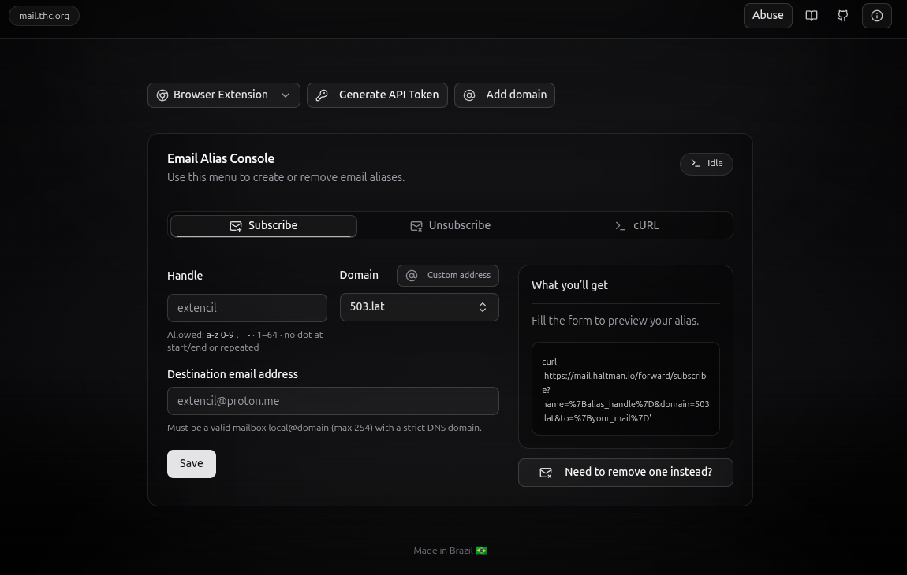
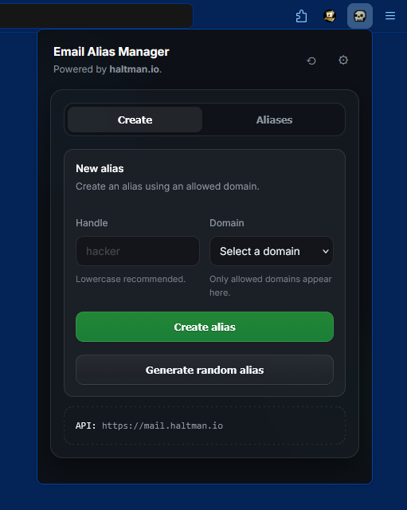
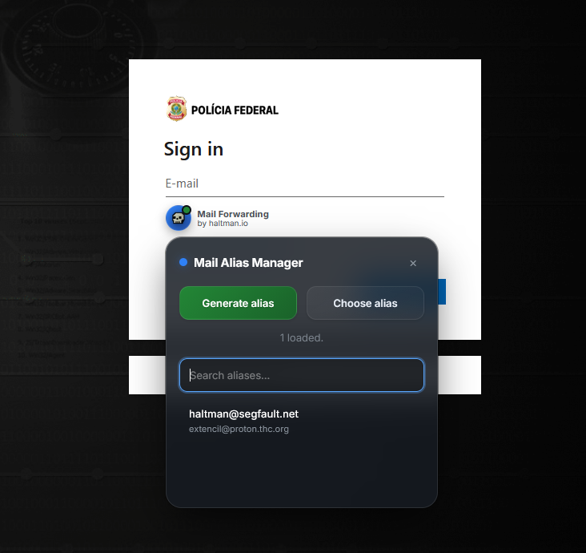
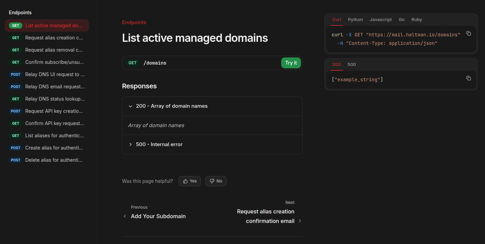

<div align="center">

<!-- Runtime / Status -->
<a href="https://forward.haltman.io/"></a>&nbsp;&nbsp;<a href="https://t.me/haltman_group"></a>


</div>

---

This repository is simply an aggregator of information. The idea here is to provide you with an overview of Haltman.io's Mail Forwarding.

---

## WTF is this?

It's a free, complete and open-source solution we created to build our own "plug and play" email forwarding system. 

### Available domains

| - | - | - | - |
| ---------------- | ---------------- | ----------------- | --------------------- | 
| 503.lat          | abin.lat         | **_pwnd.lat_**          | **_revil.org_**             |                    
| **_lockbit.io_**       | **_polkit.org_**       | haltman.org       | **_segfault.net_**          |                   
| **_unhandle.org_**     | **_homoglyph.org_**    | **_mishandle.org_**     | **_metasploit.io_**         |                 
| 1337.meu.bingo   | **_smokes.thc.org_**   | **_kerberoast.org_**    | thc.extencil.me       |              
| mvttrb.com | **_stealth.rest_** | fwd.haltman.io | halt.ciphine.com | alias-for-lammers.howosec.com |
| **_reads.phrack.org_** | **_cobaltstrike.org_** | **_johntheripper.org_** | **_the.hackerschoice.org_** |  


### Preview (some screenshots)

#### Front-end (UI)
> Source: https://mail.thc.org/



#### Browser extension (Mozilla Firefox)
> Source: https://addons.mozilla.org/en-US/firefox/addon/email-alias-manager-free/






#### API documentation
> Source: https://dev.haltman.io/api-reference/get-domains



### Features:
- "Create alias request"
- "Confirm alias creation/removal by token"
- "Request alias deletion (unsubscribe)"
- "Create API credentials request"
- "Confirm API credentials and issue API token"
- "Create alias (API key authenticated)"
- "Delete alias (API key authenticated)"
- "List aliases (API key authenticated)"
- "Check DNS status for forwarding target"
- "Submit DNS check request from UI"
- "Submit DNS check request from email flow"
- "List available domains"
- "Rate limiting and abuse protection"
- "Structured request/error logging"

## Context

@Lou-Cipher created a Perl API that allowed the creation of email aliases for The Hacker's Choice. This service was discontinued for a time after Lou-Cipher's departure.

We took it over to create a more robust infrastructure, with enhanced validation/hardening, a more modern API, and an intuitive visual interface. We didn't think about reinventing the wheel; we simply gathered what already worked, updated it for modern times, and created an API that allowed us to manage the base stack.

The goal is: <u>*Low cost*</u>, <u>*easy maintenance*</u>, **SECURE**, <u>*fast migration*</u>, and the ability to <u>*destroy the whole damn thing whenever we wanted with total guarantee that no data will survive*</u>.

Even with limited resources, we were able to create a very flexible solution by unifying the core setup with a modern stack.

## Description

This system is a mail-forwarding management stack. It allows users to create and remove email aliases securely. The project is divided into three main layers:

1. **mail-forwarding-core** (that is the unique that's really required)
2. **mail-forwarding-api**
3. **mail-forwarding-ui**
4. **mail-forwarding-dns-checker**

### mail-forwarding-core (Postfix, PostSRSd, MariaDB, OpenDKIM)
> Source code: https://github.com/haltman-io/mail-forwarding-core

* **Postfix**: Receive emails at alias email addresses, query the owner, and forward the email to the owner's intended address.
* **PostSRSd**: Receive email content from Postfix, apply SRS (Sender Rewriting Scheme), return the email to Postfix, required to circumvent SPF restrictions by replacing the envelope sender with a temporary email address from one of their own domains.
* **MariaDB**: Database, stores the data for Postfix queries.
* **OpenDKIM**: Manage DKIM key.

### mail-forwarding-api (Node.js)
> Source code: https://github.com/haltman-io/mail-forwarding-api

It allows users to create and remove email aliases with email-based confirmation, and provides secure API-key endpoints for programmatic alias management (create, delete, list, stats, and activity). It also includes a DNS validation relay to check forwarding domain readiness, with built-in input validation, rate limiting, and logging for security and reliability.

### mail-forwarding-ui
> Source code: https://github.com/haltman-io/mail-forwarding-ui

The interface helps users utilize the mail-forwarding-api through a simple, step-by-step form.

It collects data for alias creation, triggers verifications, and registers the alias in conjunction with the API.

It collects the necessary domain details, verifies DNS settings, and displays a final confirmation when everything is configured correctly.

It's a real lifesaver. There's no UI prettier than this.

*Only the V2 that we're already building is prettier, but that's a topic for another time :)*

### mail-forwarding-dns-checker
> Source code: https://github.com/haltman-io/mail-forwarding-dns-checker

The interface validates DNS configuration for the mail-forwarding service through a streamlined API-based approach.

It accepts domain submission requests for both UI (CNAME) and email forwarding (MX, SPF, DMARC) validation, initiates automatic DNS polling, and tracks verification status in real-time.

It collects the target domain from user input, verifies DNS records against expected configurations, and continuously monitors until requirements are met or the request expires.

It provides a read-only polling endpoint that returns detailed diagnostic information about missing or incorrect DNS records, helping users understand exactly what needs to be configured.

## Why the hell did we build this?


### Our sincerely opinion

We at Haltman.io still have only one question that has taken us some time to answer. Let's step outside the administrative frameworks of "technical documentation" and have a real conversation. 

Data controls the world.   

It is the most valuable thing there is, and yet we hand it over on a silver platter to any foreign company that writes in its privacy-policy.html, "We don't sell your data to third parties. Trust us, we're cool, look at our super modern UI.".

What we really wanted was:

**REINVENTING THE WHEEL? not here, thank you**:    
We didn't create an email server,  we just use one that's already robust and meets our needs.

**Avoiding "Ultra-Blaster Innovative Powered by AI" features**:       
We want to receive emails from different domains and forward them to our personal email addresses, not a Swiss Army knife that forwards emails magically trough XYZ algorithm with ABC protocol by the power of grayskull and a ULTRA-AI-SYSTEM.

**Escaping from these bull-shit of "open-core"**: 

We want:   
* Unlimited forwarding rules. 
* Unlimited users.
* Unlimited addresses.
* Unlimited domains.
* Unlimited emails.
* A picture of Ronaldinho Gaúcho on the login menu of our tool.
* * Or a hot hentai picture, whatever, who cares?

We don't want to have to stop our instance after some time because it hit some "open-core" limit.

**Self-hosting**: 

We want to run it independently, on our own infrastructure, under our own brand, on our internet connections, on our domains and in whatever way we want. 

**TO LEARN, and acquire knowledge**:

We run the project's front-end in all sorts of places: Vercel, Cloudflare Pages, GitHub Pages, Ngrok, a temporary server on segfault.net, hidden service on .onion.

We also managed to connect this shit to external bots (dc gg, tg, others).

We built browser extensions (add-on) for g00gl3 and m0z1lla. _We will never forgive Google for rejecting our add-on the first upload._

But I like to call the API directly into my terminal. Why? Idk, but why not?

The key is: **every time we tried something different, we end up learning something new.**

We even created a simple schema with Caddy using on-demand TLS because we couldn't stand having to ask our friends anymore, "yo b1tch, please create this TXT=v3rcel... entry on DNS before doing that thing", we kicked them out and hosted the damn thing ourselves. 

I allowed us to mature internally, meet new people who knew a lot about something we didn't know or knew very little about, absorb knowledge for life which we will replicate professionally, in open-source projects, to impress the g1rls on the bar or whatever else.

**BURN EVERYTHING WHEN NEEDED**:   
We want to destroy everything whenever, wherever, and when we want. 

Whether it's through a Telegram/Discord bot that receives a message and shuts down the server (LVM with LUKS), or through a custom mobile app (our own .apk), or by voice command (Alexa and others) or even by cardiac arrest, fuck it, we want to have control over destroying our own data at any moment without MITM.

We don't want to open a ticket on zendesk or to send a mail to support@... of a company. We want to trust that we won't be compromised by a third party and that we are completely certain that everything can be shut down, destroyed, and recreated elsewhere. We want intellectual freedom to think, plan, and try. We do not want to pay a subscription for this, we want to build this by our own hands.

## ABUSE

The only thing I ask is that you do not abuse our services. Despite the ironic tone, we take abuse seriously.

```
We do not tolarate abuse of our tools or services. Please contact us if you have any concern about abuse.

The tools we develop and services we provide are for research and eduational purposes only. They are meant to be used for good purposes.

THC and Haltman.IO is no place for mining-imbeciles, ransomware-idiots, DDoS-kiddos, revenge-hacking, greed, hate or criminal activites. We have no patience for this.
```

Any abuse, please contact us via root@haltman.io OR members@proton.thc.org. We will stop the abuse.

## The license is: The Unlicense &lt;unlicense.org&gt;

This is **licensed** under the **unlicense** **license**. Use it as you wish.

```
This is free and unencumbered software released into the public domain.

Anyone is free to copy, modify, publish, use, compile, sell, or
distribute this software, either in source code form or as a compiled
binary, for any purpose, commercial or non-commercial, and by any
means.

In jurisdictions that recognize copyright laws, the author or authors
of this software dedicate any and all copyright interest in the
software to the public domain. We make this dedication for the benefit
of the public at large and to the detriment of our heirs and
successors. We intend this dedication to be an overt act of
relinquishment in perpetuity of all present and future rights to this
software under copyright law.

THE SOFTWARE IS PROVIDED "AS IS", WITHOUT WARRANTY OF ANY KIND,
EXPRESS OR IMPLIED, INCLUDING BUT NOT LIMITED TO THE WARRANTIES OF
MERCHANTABILITY, FITNESS FOR A PARTICULAR PURPOSE AND NONINFRINGEMENT.
IN NO EVENT SHALL THE AUTHORS BE LIABLE FOR ANY CLAIM, DAMAGES OR
OTHER LIABILITY, WHETHER IN AN ACTION OF CONTRACT, TORT OR OTHERWISE,
ARISING FROM, OUT OF OR IN CONNECTION WITH THE SOFTWARE OR THE USE OR
OTHER DEALINGS IN THE SOFTWARE.

For more information, please refer to <https://unlicense.org/>
```

